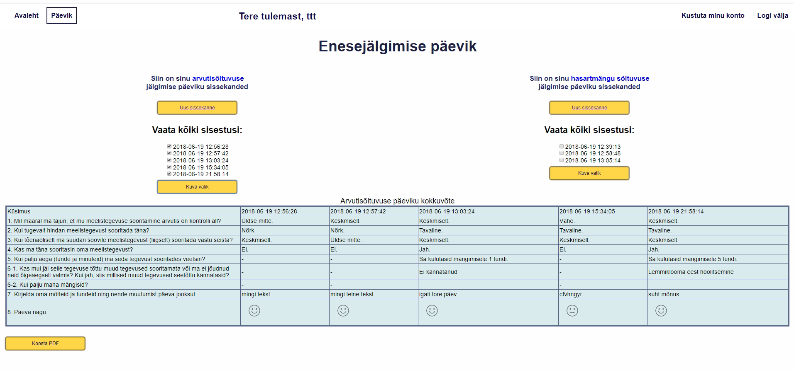

# Enesejälgimispäevik
# Hasartmängusõltlastele eneseseire tööriist

Avalik avaleht

Kasutaja avaleht

Päeviku avaleht

Päeviku täitmise küsimustik


# Projekti eesmärk 
on võimaldada hasartmängu- ja arvutisõltlastele keskkond, kus nad saavad igapäevaselt oma edusammudest ja tagasilöökidest päevikut pidada ja vajadusel sissekandeid oma nõustajale saata, et nõustamisel oleks hea ülevaade vahepealse perioodi toimumistest.

Projekt on tehtud 
# TLU DTI 
informaatika eriala esimese kursuse tarkvaraarenduse aine raames.

# Projektis osalesid:

Julika Maiste

Tanel Kuklane

Mihkel Jäe


# Kasutatud tehnoloogiad:
HTML 5.1

CSS3

JavaScript

MySQL 5.5.54

PHP 5.6.29

Chart.js 2.7.2

# Kasutusjuhend:
Lae alla ZIP fail. Ava fail ja tõsta sisu veebikataloogi. Tekita config.php 1 kaust veebikataloogist välja. Tee MYSQL käskudega andmebaasi 2 tabelit. 


# Config fail

```
<?php
	$serverHost = "xxxxxxxxx";
	$serverUsername = "xxxx";
	$serverPassword = "xxxxxxxx";
	$database = "xxxxxx";
?>

```

# MYSQL andmebaasi tabelite käsud:

```
CREATE TABLE diary( 
  id INT,
 type INT, 
 date timestamp, 
 answer1 INT, 
 answer2 INT, 
 answer3 INT, 
 nswer4 INT, 
 answer5 INT, 
 answer61 VARCHAR(1000), 
 answer62 INT, 
 answer7 VARCHAR(1000), 
 answer8 INT );

CREATE TABLE userinfo( 
  id INT AUTO_INCREMENT, 
  username VARCHAR(50), 
  email VARCHAR(128), 
  password VARCHAR(128), 
  status INT DEFAULT NULL );
```

[MIT litsents](Documents/license.txt)

